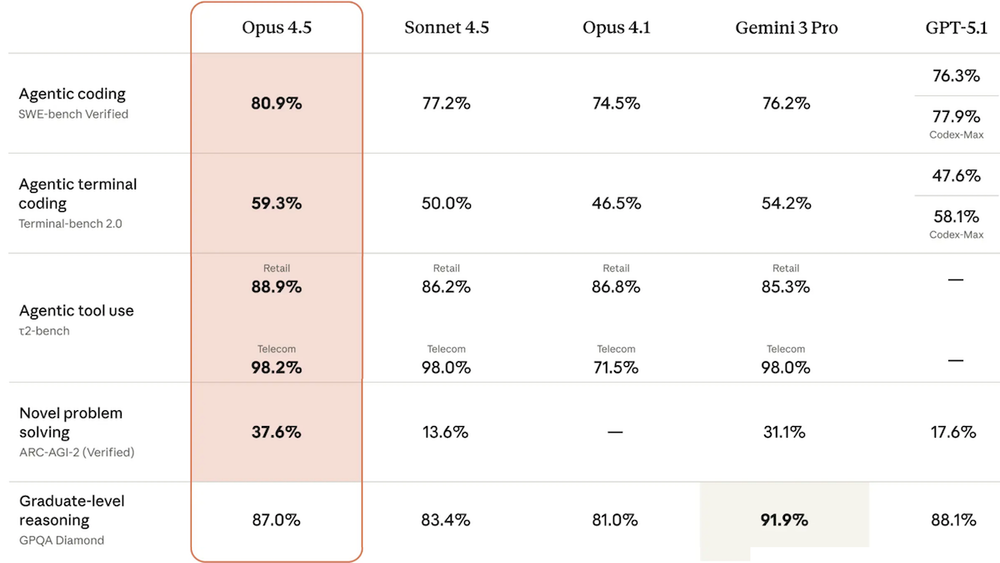

급격하게 변화하는 AI의 동향을 파악하기 위해 **Andrew Ng** 교수의 [The Batch](https://www.deeplearning.ai/the-batch/) 뉴스레터를 리뷰합니다.
 
성장하는 공학자로서, AI가 발전함에 따라 공학에 어떻게 적용할 수 있을지 고민합니다.

---

 

## 📑 최근 리뷰
💡: Andrew Ng 교수의 서문  
🖥️: 뉴스레터에서 집중적으로 소개하는 AI 동향
<table>
  <tr>
    <th width="20%">날짜 / 연번</th>
    <th width="80%">썸네일</th>
  </tr>
  <tr>
    <td align="center">
      <b>25-12-10</b> 
      Issue&nbsp;331 
      <a href="./reviews/Issue331.html"><b>리뷰 링크</b></a>
    </td>
    <td></td>
  </tr>
  <tr>
    <td colspan="2" bgcolor="#f9f9f9">
      💡 실용적인 에이전트를 만들려면 자율성에만 맡기지 말고 개발자가 <b>단계별 동작을 제어</b>해야 함  
    </td>
    <tr>
    <td colspan="2" bgcolor="#f0f2f5">
      🖥️ <b>Claude:</b> Opus 4.5 출시, 더 적은 토큰으로 정상급 성능 도달 
      🖥️ <b>백악관:</b> AI를 공동 과학자로 세우는 ‘제네시스 미션’ 발표 
      🖥️ <b>Amazon:</b> 가성비를 넘어 정상급 성능으로, Nova 2 시리즈 공개 
      🖥️ <b>소형 모델의 반란:</b> 크기보다 추론 방식이 중요하다
    </td>
  </tr>
</table>

 

## 🗄️ 전체 리뷰 아카이브

  

  <b>이전 리뷰 보기 (클릭)</b>

 

<table>
  <tr>
    <th width="20%">날짜 / 연번</th>
    <th width="80%">썸네일</th>
  </tr>
  <tr>
    <td align="center">
      <b>25-12-04</b> 
      Issue&nbsp;330 
      <a href="./reviews/Issue330.html"><b>리뷰 링크</b></a>
    </td>
    <td></td>
  </tr>
  <tr>
    <td colspan="2" bgcolor="#f9f9f9">
      💡 AI에 대한 <b>대중의 신뢰</b>가 흔들리고 있으며, 이를 해결하고자 업계의 노력이 필요함  
    </td>
    <tr>
    <td colspan="2" bgcolor="#f0f2f5">
      🖥️ <b>Meta:</b> 3D 객체 생성 파이프라인 오픈소스화 
      🖥️ <b>World Labs:</b> 수정, 편집이 가능한 3D 가상 공간 
      🖥️ <b>Baidu:</b> 텍스트, 이미지, 음성이 병합된 멀티모달 모델 
      🖥️ <b>RoboBallet:</b> 여러 대의 로봇 팔이 정교하고 동시다발적으로 협업하도록 학습하는 기술
    </td>
  </tr>
</table>

---
